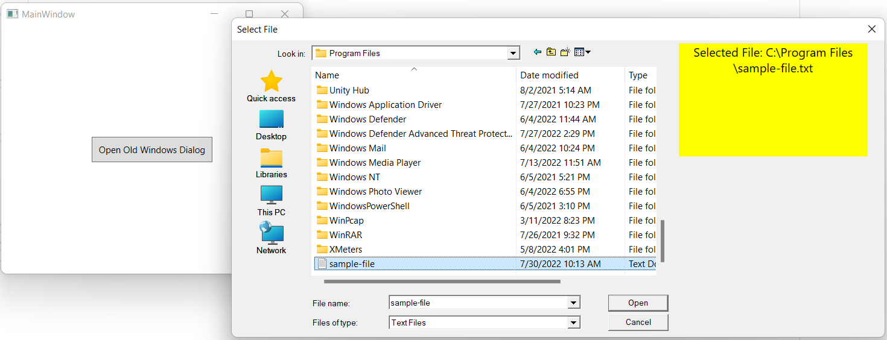

### Features
- Preview the file once the user select it.
- Callbacks for file selection, dialog closing: 
    - `OnDialogClose`, `OnFileChosen`.



### Basic Usage

Open the legacy file explorer from anywhere using

```cs
LegacyOpenFileDialogHelper.OpenCustomFileDialog<PreviewView>(
      onFileChosen: chosenFilePath => MessageBox.Show(chosenFilePath)
);
```

Where `PreviewView` is a special UserControl that inherits from `PreviewViewBase`.

`PreviewViewBase` forces overriding `PreviewCallback` method, where it gives the path of the selected file so it could be possible to update the preview accordingly.

### Sample Application

See [Sample Application](./LegacyWinExplorerWithPreviewPanel.Sample) for complete demo.